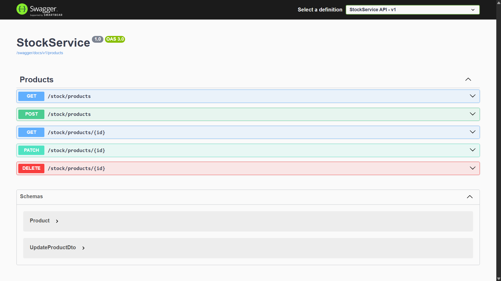
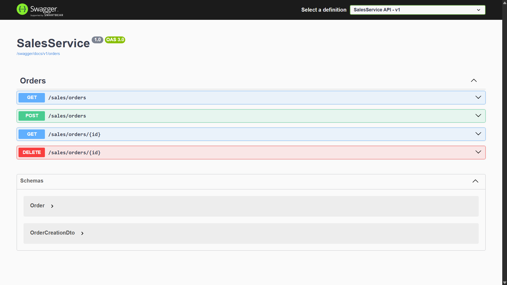
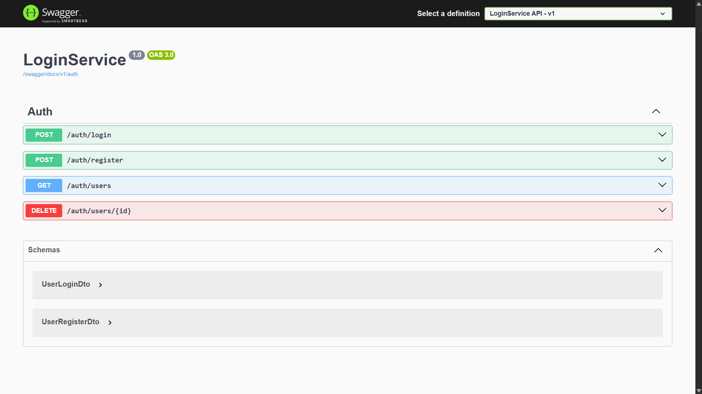

# 🧩 Microservices

## 📘 Visão Geral do Projeto

Este projeto foi desenvolvido com **arquitetura de microserviços**, utilizando **C#**, **Entity Framework** e **SQL Server**, com integração via **RabbitMQ** executado localmente. A solução é composta por **três microserviços principais** e uma **API Gateway**, que atua como ponto central para o roteamento de todas as requisições.

---

## ⚙️ Estrutura dos Serviços

- **🛡️ API Gateway:** Responsável por centralizar e redirecionar as requisições para os microserviços adequados.

- **📦 StockService:** Gerencia o estoque do sistema, oferecendo endpoints para listar, criar, atualizar e deletar produtos.

- **🛒 SalesService:** Controla os pedidos dos usuários, permitindo criar, listar e deletar pedidos.

- **👤 LoginService:** Realiza o registro, login e autenticação JWT de usuários, atribuindo permissões de **`user`** ou **`admin`** conforme necessário.

## 🖼️ Swagger Preview

<table>
  <tr>
    <td></td>
    <td></td>
    <td></td>
  </tr>
</table>

---

## 🔄 Comunicação entre os Microserviços

Os microserviços **`StockService`** e **`SalesService`** se comunicam via **RabbitMQ** para garantir o processamento assíncrono dos pedidos. O fluxo se inicia com a criação do pedido no **`SalesService`**, que envia uma mensagem para o **`StockService`** realizar a verificação de estoque. Com base nessa checagem: 
- Se o estoque for suficiente, o pedido é **confirmado**, a quantidade é **reduzida** e o status é definido como **"confirmado"**. 
- Caso contrário, se o estoque for insuficiente, o status é atualizado para **"estoque insuficiente"**. 
- E em caso de erro, o pedido é simplesmente **"cancelado"**.

---

## 🚀 Como Executar o Projeto

Siga os passos abaixo para configurar e rodar o projeto localmente:

### 1️⃣ Configurar a string de conexão
No arquivo `appsettings.json` de cada microserviço, adicione sua string de conexão ao **SQL Server**.  
```json
"ConnectionStrings": {
  "DefaultConnection": "Server=SEU_SERVIDOR;Database=SEU_BANCO;Trusted_Connection=True;TrustServerCertificate=True;"
}
```
### 2️⃣ Restaurar os pacotes
Dentro de cada projeto (LoginService, SalesService, StockService e ApiGateway), execute:
```
dotnet restore
```

### 3️⃣ Criar as migrations e atualizar o banco
Em cada microserviço que utiliza o Entity Framework, execute:
```
dotnet ef migrations add InitialCreate
dotnet ef database update
```

### 4️⃣ Iniciar os microserviços e a API Gateway
Inicie o RabbitMQ localmente e execute cada microserviço:
```
dotnet run
```

---

## 🧱 Tecnologias Utilizadas

O projeto foi desenvolvido utilizando as seguintes tecnologias e ferramentas:

- C#  
- .NET  
- SQL Server  
- Entity Framework  
- RabbitMQ (executado localmente, sem Docker)  
- JWT (JSON Web Token)  
- Microserviços  
- API Gateway

---
